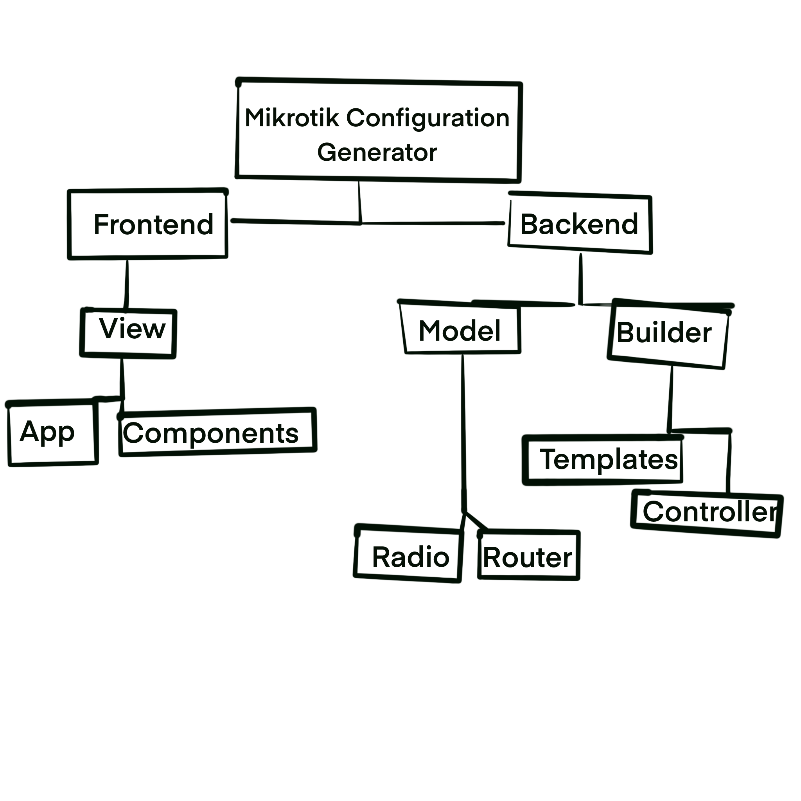
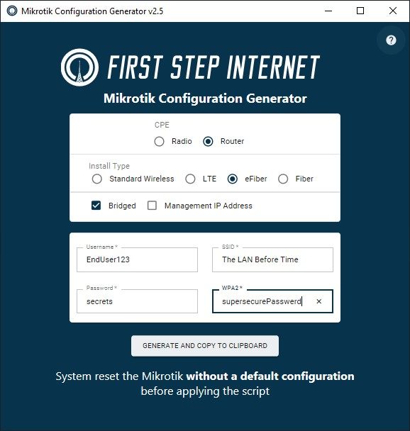

# Mikrotik Configuration Generator
A Desktop Application written by N. Cole Summers
for First Step Internet


## What is a Mikrotik?


## The Problem
Each router installed by our technicians was configured by hand.  This led to many routers having unique configurations, and misconfiguration was common.  The misconfigured routers generated support tickets, and the unique configurations increased the complexity of troubleshooting.


#### Additional Requirements
* The application needed to work offline
* Self-contained Executable 


## Mikrotik Configuration Generator v1.0
The Python Console Program


#### TUI


#### Example function
```python
def input_validation(x) :
    '''This function substitutes characters that will break
    Mikrotik Scripting Syntax with their
    corresponding hex code.'''
    syntax_breakers = {
        '[': '\\5B',
        ']': '\\5C',
        '(': '\\28',
        ')': '\\29',
        '$': '\\$',
        '?': '\\?',
        '{': '\\7B',
        '}': '\\7D',
        ':': '\\3A',
        ';': '\\3B',
        '\\': '\\\\'
    }
    syntax_breakers_list = list(syntax_breakers.keys())
    for c in x :
        for key in syntax_breakers_list:
            if c == key:
                x = x.replace(c, syntax_breakers.get(c))
                syntax_breakers_list.remove(c)
    return x
```


#### Pain Points
* Lots of duplicated code, particularly in my string templates
* A TUI was easy for me to write, but difficult for our entry-level technicians to learn


## Journey to 2.0
Possible Solutions:
* [Flutter Desktop](https://flutter.dev/multi-platform/desktop) - too new, still in alpha at the time
* Electron - memory footprint was too high for the target laptops
* Winforms - well-documented and supported native solution 
* [Fyne](https://fyne.io) - The GUI library written in Go with the most stars on Github


### Winforms and C#
* Winforms made building a GUI simple
* I used the DotLiquid library for templating

```bash
├── FrmMik.Designer.cs
├── FrmMik.cs
├── FrmMik.resx
├── Mikrotik-Configurator-DotNet5.csproj
├── Mikrotik-Configurator-DotNet5.sln
├── Program.cs
├── Properties
│   ├── Resources.Designer.cs
│   └── Resources.resx
├── Readme.md
├── azure-pipelines.yml
├── fsr-favicon.ico
└── templates
    ├── _dhcpClient.liquid
    ├── _dhcpServer.liquid
    ├── _footer.liquid
    ├── _wirelessClient.liquid
    ├── eFiber.liquid
    ├── fiber.liquid
    ├── radio.liquid
    └── standard-wireless.liquid

2 directories, 19 files
```


#### GUI


#### Example Function
```cs
private bool ValidIPAddress(string ipAddress, out string errorMessage)
        {
            Regex ip = new Regex(@"\b\d{1,3}\.\d{1,3}\.\d{1,3}\.\d{1,3}\b");
            MatchCollection result = ip.Matches(txtManIP.Text);

            // Confirm that the IP address string is not empty
            if (ipAddress.Length == 0)
            {
                errorMessage = "Management IP is empty.  Enter a management IP or uncheck the Management IP Address Checkbox.";
                return false;
            } 
            else if (result.Count > 0)
            {
                errorMessage = "";
                return true;
            }
            else
            {
                errorMessage = "Please enter a valid IP Address.";
                return false;
            }
        }
```


#### Why not C#?
Single File Executables, a feature of .NET 5.0, were only supported on Linux and MacOS.  It was originally supposed to be in .NET 5.0, but was pushed back to .NET 6.0.  I couldn't wait for the release of .NET 6.0, so this prototype was scrapped.


### Go to the Rescue
Around this time I started looking into Go for a solution.  The embed package had just been released, making it simple to embed any file into your final Go binary.  Between this and the standard library's templating engine, Go was a promising target.  

I wasn't able to use Fyne for a graphics library in the end, because our old laptops did not have a graphics driver with OpenGL support.  That's when I discovered the [Wails](https://wails.app) framework, which finally met all of the project requirements.


## Mikrotik Configuration Generator 2.0



#### Current UI (2.5)



#### Example Code (Go)
```go
app := wails.CreateApp(&wails.AppConfig{
		Width:     576,
		Height:    576,
		Title:     "Mikrotik Configuration Generator v" + version,
		JS:        js,
		CSS:       css,
		Colour:    "#131313",
		Resizable: true,
	})

	app.Bind(builder.BuildFiber)
	app.Bind(builder.BuildeFiber)
	app.Bind(builder.BuildRadio)
	app.Bind(builder.BuildRouter)
	app.Run()
```


#### Consuming a backend function from the frontend (JS)
```js
var myRouter = {
    Username: this.state.username,
  Password: this.state.password,
  Installation: this.state.selectedInstall,
  DisableWiFi: this.state.disableWiFi,
  SSID: this.state.ssid,
  WPA2: this.state.wpa2,
  Bridge: this.state.bridged,
  LTE: false
}

window.backend.BuildRouter(myRouter)
```


#### Example Component (ReactJS/[MUI](http://mui.com))
```js
import React from 'react';
import IconButton from '@material-ui/core/IconButton';
import HelpIcon from '@material-ui/icons/Help';

const runtime = require('@wailsapp/runtime');

export default function HelpButton() {
  return (
    <div className="help">
      <IconButton
      aria-label="Help" color="secondary" 
      onClick={() => runtime.Browser.OpenURL('http://wiki.fsr.com/index.php?title=Mikrotik_Configuration_App')}>
        <HelpIcon />
      </IconButton>
    </div>
  );
}
```


### Room for improvement
Things I'd like to change:
* Add animations when components pop in or out
* Swap Material UI components for [Headless UI](https://headlessui.dev) and [TailwindCSS](https://tailwindcss.com)
* If I started today I'd write the app with .NET6/[MAUI](https://docs.microsoft.com/en-us/dotnet/maui/what-is-maui) or [Tauri](https://tauri.studio/en/)


# Questions?